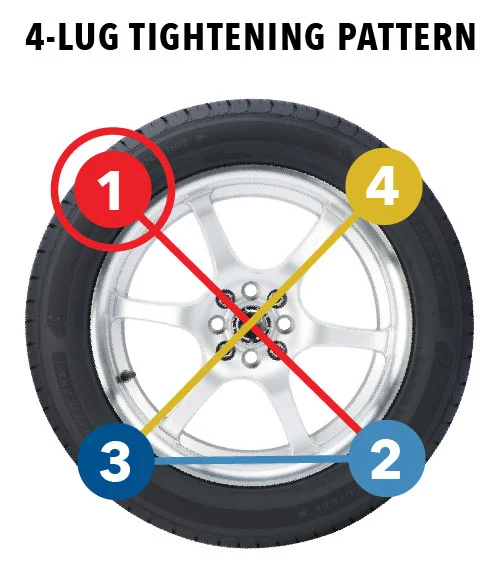

#Project Planning

##TIM Definition statement

I want to build a application that helps with “adulting”. I want it to keep track of all the things that we tend to be to busy to keep track of and happen to lose it when we need it most, such as warranties, or maintenance we need to do on our houses and vehicles. I also want it to have information for “adulting” for things we need to know or at least should know but are too embarrassed to ask for help on, maybe things such as changing a tire, or tying a tie, or proper etiquette for fancy events.

## User story
[Mural of User Story ](https://app.mural.co/t/intelliseatbychibitech6080/m/intelliseatbychibitech6080/1699581688498/b3a1da8d7008d07379291d4ff735745d5d917b5b?sender=u9310bf2005f469df4d7c6625)

## SWOOT Analysis
[Current-Swoot-Anlysis](https://docs.google.com/document/d/1w7Jzm8WaT_iu8JqLGFAgaL6ZE1GkoeihHBjw5o3fBow/edit)

## images being used

In terms of design I am using a mobile responsive design over mobile-first design, this is because, I consider that most people when considering things like their budget or schedule would be at a computer,
to sit through and plan those things out. Yet they would want to check those things when they are out and about. For example, You might have a monthly budget planned and some buddies ask you if you want to go to the movies. You'd probably want to check it on your phone to see if it is in your schedule/budget to do so. However, you wouldn't want to just be on your phone when you are examing the totallity of your finances. This is why I am going with web responsive. Because the bulk of the use case would be on one's PC however, the secondary use would be on mobile.

## Wire Frames
### Home page Wireframe

### Eisenhower Matrix Wire Frame

## User Road Map

## Logo for Website (Rough draft)

